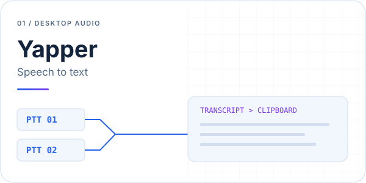

# Yapper

Yapper is a Windows speech-to-text application with two independent push-to-talk channels. Each channel has its own microphone, shortcut, and transcription language. The recognition engine is selected for the whole application.

[Published builds](https://github.com/Xcape53/Yapper/releases) · [Run from source](#requirements-and-installation) · [Privacy](#privacy)

<picture>
<source media="(prefers-color-scheme: dark)" srcset="docs/profile/cover-dark.svg">

</picture>

## Everyday dictation

Hold a channel shortcut while speaking, release it to transcribe, then paste the result into your application. Two channels let you keep separate microphones and languages ready. Online recognition uses the selected provider; Vosk provides local offline transcription.

The latest published build is **v1.2.0**. The source branch includes the newer Groq integration described below.

## Current source: 1.3.0

- Groq Whisper transcription with **Whisper Large V3** and **Whisper Large V3 Turbo** in the GUI.
- Groq is the default engine; Large V3 is the default model.
- Polish, English, and automatic language detection for Groq.
- Compact window height that fits the visible panels.
- API keys and vocabulary hints configured in files, outside the GUI.
- Groq errors leave the clipboard unchanged and never trigger Google fallback.
- Gemini usage and latency logging, configurable chunk duration, and asynchronous authentication after selecting Gemini.

## Requirements and installation

- Windows 10 or Windows 11
- Python 3.11 or newer when running from source
- A working microphone and credentials for the selected online engine

```powershell
python -m venv .venv
.venv\Scripts\Activate.ps1
pip install -r requirements.txt
Copy-Item settings.example.json settings.json
Copy-Item .env.example .env
```

Copy the example files only during initial setup. Keep existing configuration when upgrading.

## Groq Whisper configuration

Create a key in the [Groq console](https://console.groq.com/keys), then set it in `.env`:

```env
GROQ_API_KEY=your_groq_api_key
```

For the packaged app, `.env` belongs next to `Yapper.exe`, normally in `dist/`. For source execution, it belongs next to `Yapper.py`. Existing Gemini environment configuration can remain in the same file. An existing `GROQ_API_KEY` environment variable takes precedence over `.env`.

The GUI does not display, edit, or save API keys. Restart Yapper after changing the key. Keys are not included in settings exports, logs, or the executable.

Select either Whisper model in the GUI. **Large V3** prioritizes multilingual accuracy; **Turbo** prioritizes speed and cost. Groq reports WER of 10.3% and 12%, respectively, but these are not a separate Polish benchmark. Test representative recordings to compare accuracy for your own speech. See the [Groq model comparison](https://console.groq.com/docs/speech-to-text).

Vocabulary hints are configured only in the `groq` section of `settings.json`:

```json
{
  "groq": {
    "model_id": "whisper-large-v3",
    "prompt": "Yapper, GitHub, Beczek"
  }
}
```

Merge this section into the existing file, preserving the other settings. Use `dist/settings.json` for the packaged app, or the file next to `Yapper.py` for source execution. Restart after editing vocabulary. An empty `prompt` disables hints. Saving GUI settings preserves vocabulary edited in the file.

The prompt guides spelling and terminology, with a provider limit of 224 tokens. It does not execute Gemini-style instructions such as rewriting a transcript or removing filler words.

Audio captured as mono 16-bit PCM is uploaded as WAV using multipart requests to `/openai/v1/audio/transcriptions`. No ffmpeg installation is needed. WAV payloads are limited to 24 MB per request; longer recordings are split with a one-second overlap. Exact overlapping words are merged, but chunk boundaries can still affect recognition. If any chunk fails, the partial transcript is not copied. See [Groq speech-to-text documentation](https://console.groq.com/docs/speech-to-text).

Provider access and free-plan limits are covered in [provider notes](docs/provider-access.md).

## Other recognition engines

- **Vertex AI Gemini:** configure `vertex_ai` in `settings.json` or the Google variables in `.env`. The current default is `gemini-3.5-flash`, with `gemini-2.5-flash` as quota fallback. Gemini uses MP3 and defaults to 30-second chunks; `gemini_chunk_seconds` in `settings.json` changes the threshold. Custom rewriting rules appear only when Gemini is selected.
- **Google Speech Recognition:** select Google in the GUI. This mode requires an internet connection.
- **Vosk:** install a compatible local Vosk model for offline recognition. Audio stays on the device in this mode.

## Running the application

```powershell
python Yapper.py
```

Choose the engine, microphones, channel languages, and shortcuts, then save the configuration. Interface language is independent of transcription language. Hold a channel shortcut while speaking and release it to transcribe. Clips shorter than one second are ignored. Successful text is copied to the clipboard. Tray controls and sound cues remain available.

## Tests and Windows build

Run tests without an API key or sending audio:

```powershell
.\.venv\Scripts\python.exe -m unittest discover -s tests -v
```

Build the executable using the project virtual environment:

```powershell
.\.venv\Scripts\python.exe -m pip install pyinstaller
.\build.ps1
```

The output is `release_staging/groq/Yapper.exe`. The build script limits PATH to avoid collecting incompatible DLLs from unrelated developer tools. Copy the executable into your application folder while preserving local configuration.

Do not include `.env`, personal `settings.json`, OAuth credentials, tokens, logs, or recordings in published packages. Distribute example configuration instead.

## Privacy

Groq, Gemini, and Google modes transmit audio to external services. Vosk processes audio locally. Local API keys are stored in `.env`; configuration and credential files are excluded from Git. Review the selected provider's data policy before sending sensitive audio.

## License

No license has been granted for this repository unless a license file states otherwise.
